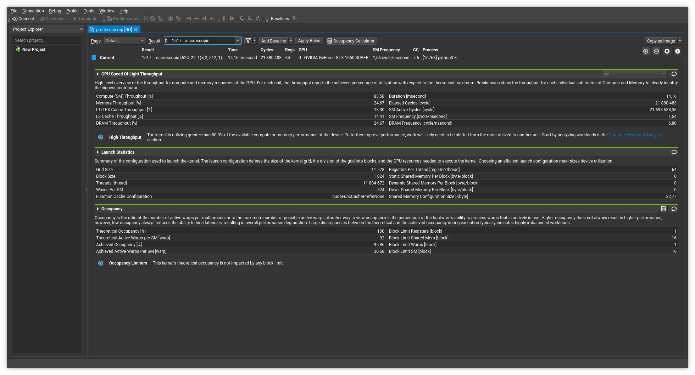

# The Lattice Boltzmann Method on GPU


This example is fluid flow from left to right over a cylinder in top view.

## Goal

The goal of this project is to make parallel the Lattice Boltzmann Method on GPU through `numba` and `cupy`.

## Installation

You need to know your cuda version to install `cupy` correctly.
My version is `11.6` (you can see it in `setup.py`).
Create a virtual environment and install the requirements :
```
pip install -r requirements.txt
```

## Usage

### Parameters

In `utils/parameters.py`, you can change parameters of the simulation :
```python
maxIter = 8 * 15 * 5 * 10  # Total number of time iterations.
# 8 * 15 for frames per second (= 120)
# 5 for seconds
# 10 because every 10 steps, the program saves the state
Re = 150.0  # Reynolds number.
nx, ny = 1024, 22 * 32  # Number of lattice nodes.
# 1024 because my GPU can use 1024 threads per block maximum
# 22 for the number of Streaming Multiprocessors
# 32 is a multiple of 2 (could be 64, 128, ...)
ly = ny - 1  # Height of the domain in lattice units.
cx, cy, r = nx // 4, ny // 2, ny // 9  # Coordinates of the cylinder.
uLB = 0.04  # Velocity in lattice units.
nulb = uLB * r / Re
# Viscoscity in lattice units.
omega = 1 / (3 * nulb + 0.5)
```

### Run programs

```sh
# numba
python numba_lbmFlowAroundCylinder.py
# cupy
python kcupy_lbmFlowAroundCylinder.py
# cupy without kernels (only functions already implemented)
# it is less optimized
python cupy_lbmFlowAroundCylinder.py
# original method (sequential with numpy)
python lbmFlowAroundCylinder.py
```

### Tests

To generate references for tests, you can save them in `pickle` files by running :
```
python alltests.py -p
```
They will be saved in `tests/picklefiles`.

Now, you can check that everything works :
```sh
# numba tests
python alltests.py
# cupy tests
python alltests.py -c
```

## Profiling



You can profile programs to study performance of kernels.
You should reduce the number of iterations in parameters (`utils/parameters.py`):
```python
maxIter = 3  # Total number of time iterations.
```
Then you should comment `cv2` steps in `numba_lbmFlowAroundCylinder.py` or `kcupy_lbmFlowAroundCylinder.py` depending if you want to improve performance with `numba` or `cupy` :
Before commenting :

```python
# ...
import cv2
# ...
frameSize = (INTNX, INTNY)
path_video = "output_video.avi"
bin_loader = cv2.VideoWriter_fourcc(*"DIVX")
out = cv2.VideoWriter(path_video, bin_loader, 120, frameSize)

def main():
  # ...
  for time in range(maxIter + 1):
    # ...
    if time % 10 == 0 and time != 0:
          print(round(100 * time / maxIter, 3), "%")
          u = d_u.get()
          arr = np.sqrt(u[0] ** 2 + u[1] ** 2).transpose()
          new_arr = ((arr / arr.max()) * 255).astype("uint8")
          img_colorized = cv2.applyColorMap(new_arr, cmapy.cmap("plasma"))
          out.write(img_colorized)

    out.release()
```

After commenting :

```python
# ...
# import cv2
# ...
# frameSize = (INTNX, INTNY)
# path_video = "output_video.avi"
# bin_loader = cv2.VideoWriter_fourcc(*"DIVX")
# out = cv2.VideoWriter(path_video, bin_loader, 120, frameSize)

def main():
  # ...
  for time in range(maxIter + 1):
    # ...
    # if time % 10 == 0 and time != 0:
    #       print(round(100 * time / maxIter, 3), "%")
    #       u = d_u.get()
    #       arr = np.sqrt(u[0] ** 2 + u[1] ** 2).transpose()
    #       new_arr = ((arr / arr.max()) * 255).astype("uint8")
    #       img_colorized = cv2.applyColorMap(new_arr, cmapy.cmap("plasma"))
    #       out.write(img_colorized)
    #
    # out.release()
```
Then you can run :
```sh
sh ncu-profiler.sh numba_lbmFlowAroundCylinder.py # or kcupy_lbmFlowAroundCylinder.py
```
It will produce a file where all data are stored (`profile.ncu-rep`).
Then, you can use the UI from Nvidia :
```sh
sh nsight-profiler-ui.sh profile.ncu-rep # or without argument if you want only to open the application
```

## Some results for kernels

The GPU to get the following results is [NVIDIA A100 TENSOR CORE GPU](https://www.nvidia.com/en-us/data-center/a100/) where :
- The number of Streaming Multiprocessors is `108`.
- The number of nodes is `nx, ny = 2048, 216 * 32`

Note : current parameters in scripts are chosen for the [NVIDIA GEFORCE GTX 1660 Super](https://www.nvidia.com/en-us/geforce/news/nvidia-geforce-gtx-1660-super-1650-super/). Then the number of Streaming Multiprocessors is `22`.

### Numba

|   Kernel name  | Execution Duration | Compute Throughput | Memory Throughput | L1 Cache Throughput | L2 Cache Throughput |
| :------------: | :----------------: | :----------------: | :---------------: | :-----------------: | :-----------------: |
|   macroscopic  |       7.67 ms      |       6.79 %       |      90.08 %      |       90.52 %       |       51.71 %       |
|   equilibrium  |       2.34 ms      |       19.05 %      |      88.02 %      |       88.49 %       |       58.85 %       |
| streaming_step |       2.18 ms      |       57.37 %      |      85.31 %      |       85.75 %       |       83.36 %       |
|    collision   |       4.56 ms      |       6.29 %       |      70.96 %      |       71.52 %       |       64.97 %       |
|   bounce_back  |      345.09 µs     |       16.49 %      |       71.9 %      |        72.6 %       |       65.08 %       |
|     inflow     |      17.95 µs      |       2.03 %       |       3.47 %      |        0.96 %       |        4.09 %       |
|   update_fin   |      10.37 µs      |       0.73 %       |       5.26 %      |        2.19 %       |        7.31 %       |
|     outflow    |       9.31 µs      |       0.72 %       |       3.12 %      |        2.13 %       |        4.58 %       |

### Cupy

|   Kernel name  | Execution Duration | Compute Throughput | Memory Throughput | L1 Cache Throughput | L2 Cache Throughput |
| :------------: | :----------------: | :----------------: | :---------------: | :-----------------: | :-----------------: |
|   macroscopic  |       8.05 ms      |       6.79 %       |      91.09 %      |       91.77 %       |       51.15 %       |
| streaming_step |       2.14 ms      |       25.37 %      |       86.8 %      |       87.24 %       |        82.5 %       |
|   equilibrium  |       2.33 ms      |       19.11 %      |      88.36 %      |       88.97 %       |       59.31 %       |
|    collision   |       4.74 ms      |        4.9 %       |      67.45 %      |        67.7 %       |       62.43 %       |
|   bounce_back  |      340.45 µs     |       12.2 %       |      72.74 %      |       73.92 %       |       65.38 %       |
|   update_fin   |      10.56 µs      |       0.65 %       |       6.21 %      |        2.28 %       |        7.87 %       |
|     inflow     |      10.82 µs      |       0.82 %       |       5.15 %      |        1.98 %       |        7.88 %       |
|     outflow    |       9.7 µs       |       0.52 %       |       3.44 %      |        2.26 %       |        4.86 %       |
